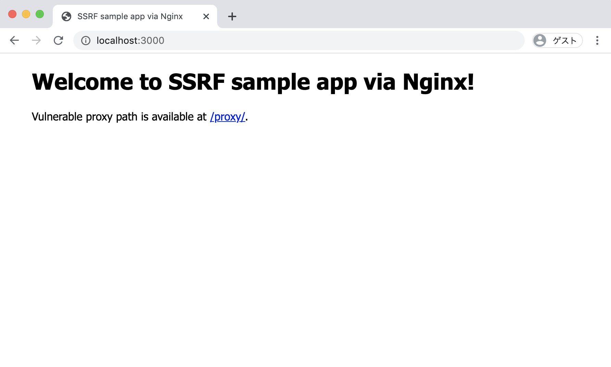
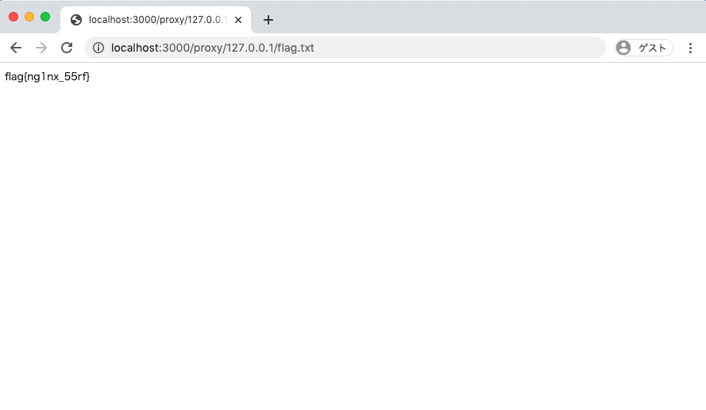

# Nginx SSRF sample app





## How to use
Dockerfile exists. Sample app work on any port.

```
$ docker build -t nginx-ssrf .
$ docker run -d -p 127.0.0.1:3000:80 nginx-ssrf:latest
```

## Tools to find
[Gixy](https://github.com/yandex/gixy) is a tool to analyze Nginx configuration.

```
$ gixy vulnerable.conf 

==================== Results ===================

>> Problem: [ssrf] Possible SSRF (Server Side Request Forgery) vulnerability.
Description: The configuration may allow attacker to create a arbitrary requests from the vulnerable server.
Additional info: https://github.com/yandex/gixy/blob/master/docs/en/plugins/ssrf.md
Reason: At least variable "$1" can contain untrusted user input
Pseudo config:

server {
	server_name localhost;

	location ~ /proxy/(.*)/(.*)$ {
		proxy_pass http://$1/$2;
	}
}

==================== Summary ===================
Total issues:
    Unspecified: 0
    Low: 0
    Medium: 0
    High: 1

```

## Licence
The MIT License